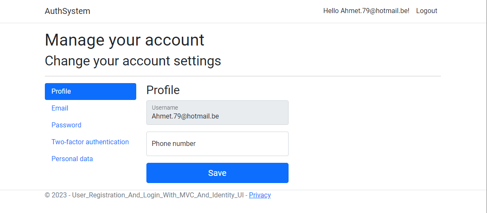
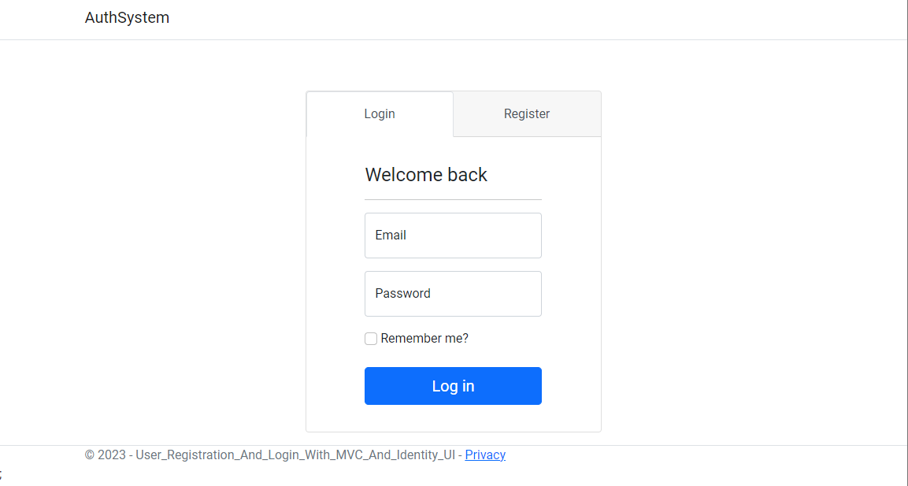
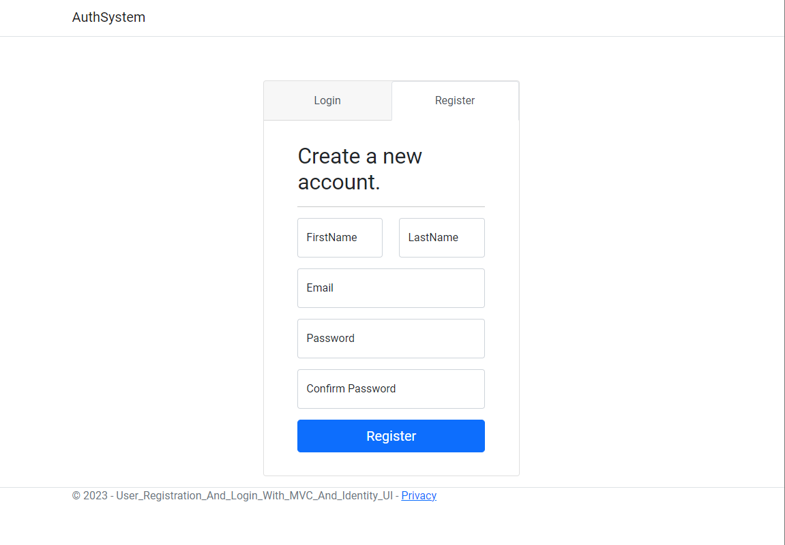
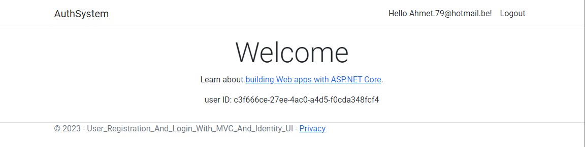

# Projectnaam

Authentication System

## Over de App

Deze applicatie is ontwikkeld om te illustreren hoe Identity UI binnen ASP.NET Core werkt en hoe het kan worden aangepast en uitgebreid om aan specifieke projectvereisten te voldoen. Hieronder volgen enkele van de belangrijkste functies en concepten die in deze app worden gedemonstreerd:

1. Toevoegen van Asp.Net Core Identity
2. Nieuwe Eigenschappen Toevoegen aan Identity
3. Aanpassen van Wachtwoordvalidaties
4. Weergeven van Ingelogde Gebruikersgegevens in App NavBar
5. Inlogformulier
6. Ophalen van ingelogde gebruikers-id of gebruikersclaims
7. Autorisatie

## Voorbeelden

*Dit is een schermafbeelding van de accountinstellingenpagina van de applicatie, weergegeven wanneer een gebruiker is ingelogd. De pagina toont opties en functies waarmee gebruikers hun accountgegevens kunnen beheren, wachtwoorden kunnen wijzigen en andere persoonlijke voorkeuren kunnen aanpassen.*

*Deze afbeelding toont het inlogformulier van de applicatie, waarbij het veld voor gebruikersnaam is geselecteerd. Wanneer gebruikers op dit veld klikken, wordt het actief en klaar om tekstinvoer te accepteren. Dit is een momentopname van de interactieve gebruikerservaring tijdens het inlogproces.*

*Deze afbeelding toont het registratieformulier van de applicatie, waarbij een van de velden voor registratie is geselecteerd. Gebruikers kunnen hun gegevens invoeren in dit actieve veld, zoals gebruikersnaam, e-mail en wachtwoord, om een nieuw account aan te maken. Dit beeld illustreert de gebruikersinteractie tijdens het registratieproces.*

*Deze afbeelding toont het dashboard van de applicatie nadat een gebruiker succesvol is ingelogd. Gebruikers kunnen hier toegang krijgen tot verschillende functies, informatie en acties die beschikbaar zijn voor ingelogde gebruikers. Dit beeld geeft een glimp van de gebruikerservaring na het inloggen.*